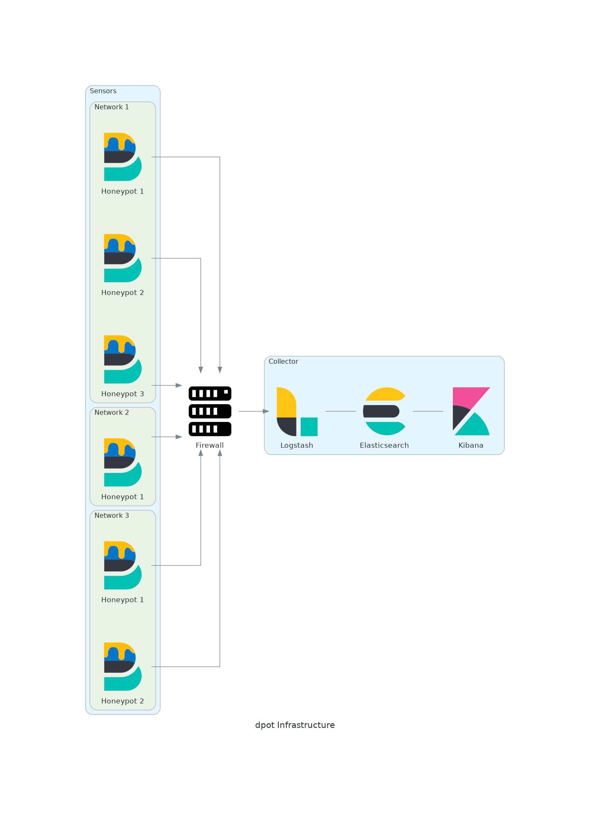

# dpot 🍯
> A centralized but distributed honeypot system inspired by `telekom-security/tpotce`

## Introduction

Based on the T-Pot Honeypot framework, this projects makes it easy to deploy and monitor a distributed honeypot infrastructure.

## Infrastructure:

## Collector

todo
## Sensor

todo
---